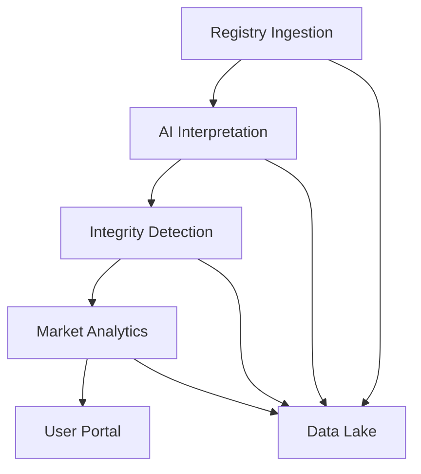

# Universal Carbon Intelligence Platform — Expanded Draft Plan

## 1. High-Level Architecture
A modular, layered system:
- **Data Ingestion Layer:** Registry, document, GIS, and satellite data collection
- **AI Interpretation Layer:** NLP/LLM-based extraction and standardization
- **Integrity Detection Layer:** Geospatial, issuance, and risk scoring
- **Market Layer:** Exposure, analytics, liquidity, and user onboarding
- **Central Data Lake:** Stores all raw and processed data
- **Microservices:** Each agent is a service, communicating via event bus/API
- **User Portal:** Analytics, onboarding, reporting

### Architecture Diagram

---

### Backend Architect Recommendations
**Security:**
- End-to-end encryption, fine-grained IAM, centralized secrets, API rate limiting.
**Scalability:**
- Stateless services, distributed cache, circuit breakers, managed event bus, horizontal scaling.
**Data Quality:**
- Validation, schema enforcement, lineage tracking, centralized logging/metrics, alerting.
**Maintainability:**
- API versioning, automated CI/CD, integration tests, documentation.
**Best Practices:**
- Idempotent ops, soft deletes, immutable storage, GDPR compliance.
**Risks:**
- Data quality, model accuracy, privacy, integration complexity.

## 2. Detailed Flows & Implementation Steps

### Phase 1: Foundation
#### Registry Ingestion Agent
- **Flow:**
  - Schedule/trigger registry scrapes (API, web, file)
  - Normalize and store in data lake
- **Implementation:**
  - ETL pipelines (Airbyte/custom Python)
  - Modular connectors per registry
  - Logging, error handling, change tracking
- **Fireframes:**
  - Registry API down, data format changes, duplicate records

**Data Engineer Recommendations:**
- Explicit data contracts, idempotency, deduplication, partitioning, automated data quality checks, lineage tracking, modular connectors, robust logging, dead-letter queues, pipeline observability, incremental ingestion, test harnesses.
- **Risks:** Schema drift, incomplete geospatial data, model hallucination, lack of monitoring.

#### Document Extraction Agent
- **Flow:**
  - Ingest PDFs/reports
  - OCR + NLP extraction
  - Map to standard schema
- **Implementation:**
  - Tika/PDFMiner + LLMs
  - Human-in-the-loop for edge cases
- **Fireframes:**
  - Corrupt files, ambiguous mapping

#### Geospatial Analysis Agent
- **Flow:**
  - Ingest GIS/satellite data
  - Detect overlaps/conflicts
  - Flag anomalies
- **Implementation:**
  - PostGIS/GeoPandas
  - Polygon intersection algorithms
- **Fireframes:**
  - Incomplete coordinates, conflicting projections

**Geographer Recommendations:**
- Strict CRS validation, auto-reproject, geometry validation, quarantine invalid geometries, spatial indexing, batch/parallel processing, tiling, standardize projections, document/version sources, robust libraries, support common GIS formats, clear API contracts, monitor projection mismatches, automated spatial tests.
- **Risks:** Incomplete coordinates, projection conflicts, performance bottlenecks, custom geometry code.

### Phase 2: Intelligence Layer

#### AI Interpretation Agent
- **Flow:**
  - Parse project docs
  - Extract metrics, risks, narratives
  - Standardize outputs
- **Implementation:**
  - LLMs (OpenAI/HuggingFace)
  - Custom extractors for key fields
- **Fireframes:**
  - Model hallucination, unhandled doc types

**AI Engineer Recommendations:**
- Data validation, high-quality labeling, model drift monitoring, shadow/A-B testing, explainability tools (SHAP/LIME), log decisions, bias audits, containerized serving, automated retraining, prompt engineering, RAG for LLMs, human-in-the-loop for high-impact, document model limitations.
- **Risks:** Hallucination, drift, false positives/negatives, overfitting, privacy, explainability gaps.

#### Integrity Detection Agent
- **Flow:**
  - Analyze issuance, retirements, monitoring
  - Detect double counting, delays, anomalies
- **Implementation:**
  - Rule-based + ML anomaly detection
  - Cross-registry correlation
- **Fireframes:**
  - False positives/negatives, registry data lag

#### Risk Scoring Agent
- **Flow:**
  - Aggregate project data
  - Score transparency, permanence, etc.
- **Implementation:**
  - Weighted scoring models
  - Explainable AI
- **Fireframes:**
  - Score manipulation, incomplete data

### Phase 3: Market & User Layer

#### Market Analytics Agent
- **Flow:**
  - Track sales, liquidity, pricing
  - Generate alerts/signals
- **Implementation:**
  - Real-time data feeds
  - Dashboard visualizations
- **Fireframes:**
  - Market data outages, price manipulation

#### User/Project Onboarding Agent
- **Flow:**
  - Connect registry accounts
  - Expose inventory/listings
- **Implementation:**
  - OAuth/API integrations
  - User dashboard
- **Fireframes:**
  - Auth failures, privacy issues

#### Automated Due Diligence & Predictive Failure Agents
- **Flow:**
  - Summarize project health
  - Predict risks/failures
- **Implementation:**
  - LLM-based summary
  - Time-series ML for prediction
- **Fireframes:**
  - Overfitting, missed early warnings

**UI Designer Recommendations:**
- Clarify user journeys, specify dashboard modules, add accessibility (WCAG AA, keyboard, screen reader), visual hierarchy, personalization, mobile-first, modular React, error/loading states, usability testing.
- **Risks:** Data overload, accessibility gaps, security/privacy.

## 3. Technology Choices & Rationale
- **Data Lake:** S3-compatible
- **ETL:** Airbyte, custom Python
- **Geospatial:** PostGIS, GeoPandas
- **AI/NLP:** OpenAI, HuggingFace, custom LLMs
- **Frontend:** React/Next.js
- **API:** FastAPI/Node.js
- **Event Bus:** Kafka/NATS

---

## 4. Example Flows
- **End-to-end:** Registry → Ingestion → Data Lake → AI → Integrity → Market → User Portal
- **User:** Logs in → Connects registry → Views project risk/market status → Downloads due diligence report

---

## 5. Risks & Value Points
- **Risks:** Data quality, registry resistance, model accuracy, privacy
- **Value:** Unified view, automated integrity, market transparency, actionable insights

---

## 6. Next Steps
- Review with client for feedback
- Prioritize registry connectors and MVP flows
- Plan pilot with real data

---
This draft is ready for client discussion and refinement.