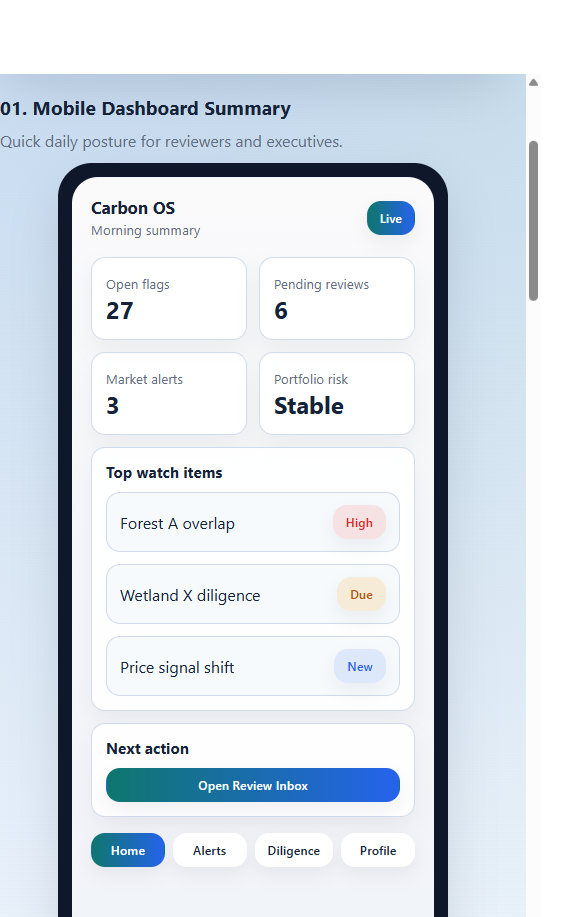
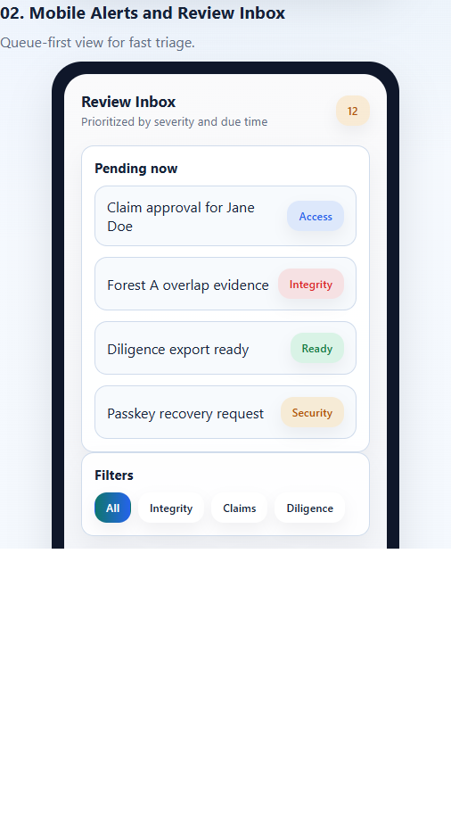
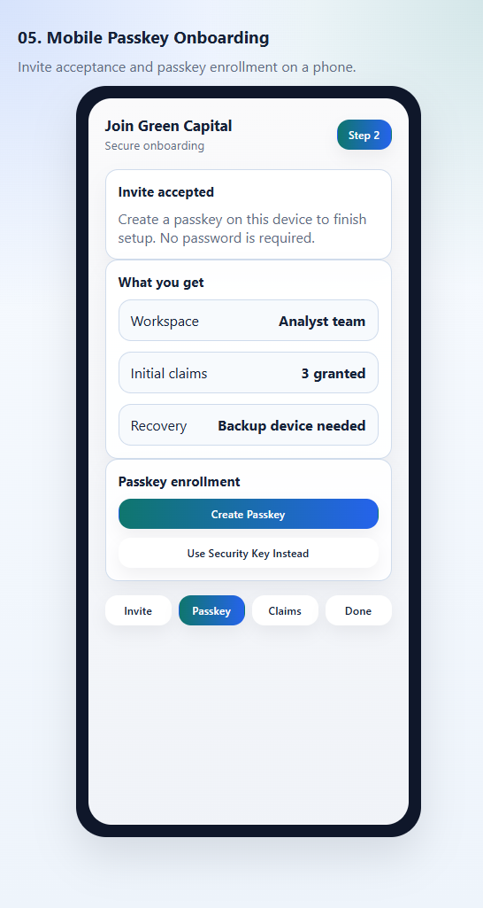
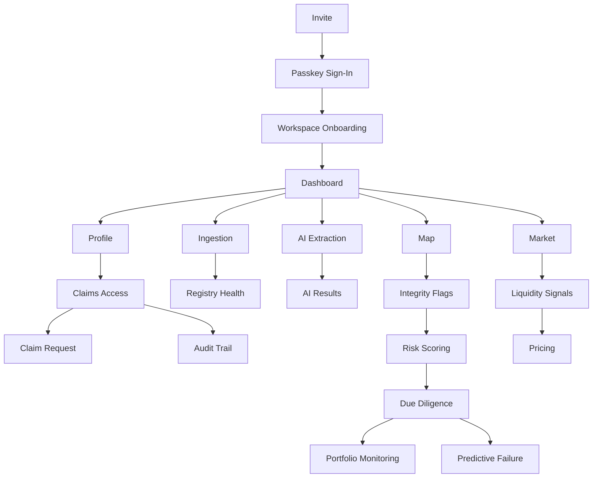

# Universal Carbon Intelligence Platform — Wireframes

This document is GitHub-friendly by design: the editable wireframes live in HTML, while the screenshots below remain visible in Markdown previews. The refreshed designs follow a modern Tailwind + daisyUI dashboard language with cards, stats, badges, tabs, and cleaner app-shell layouts. The desktop gallery is intentionally shown as full-screen application frames because that level of fidelity is useful for handoff.

## Assets

- Desktop gallery: [wireframes/index.html](wireframes/index.html)
- Mobile gallery: [wireframes/index_mobile.html](wireframes/index_mobile.html)
- Desktop screenshot folder: [wireframes/screenshots](wireframes/screenshots)
- Mobile screenshot folder: [wireframes/screenshots/mobile](wireframes/screenshots/mobile)

## Screen Map

1. Dashboard overview
2. Data ingestion and upload
3. Geospatial map and analysis
4. Document extraction and AI insights
5. Market and trading view
6. User profile and settings
7. Registry ingestion dashboard
8. AI interpretation results
9. Integrity detection center
10. Dynamic risk scoring overview
11. Liquidity and market signals
12. Automated due diligence summary
13. Predictive failure and MRV companion
14. Pricing engine and SDG or biodiversity overlay
15. Portfolio monitoring
16. Passkey or FIDO sign-in
17. Workspace onboarding
18. Claims access management
19. Claim request and approval
20. Auth and access audit trail

## Mobile Screen Map

1. Mobile dashboard summary
2. Mobile alerts and review inbox
3. Mobile project snapshot
4. Mobile due diligence summary
5. Mobile passkey onboarding

## 1. Dashboard Overview

Purpose: high-level summary of carbon data, recent activity, alerting, and shortcuts into the main modules.

## 2. Data Ingestion and Upload

Purpose: upload structured and unstructured sources, monitor progress, and inspect ETL errors.

## 3. Geospatial Map and Analysis

Purpose: explore projects on a map, toggle analytical layers, and inspect project details.

## 4. Document Extraction and AI Insights

Purpose: extract metrics from long-form source documents and let users review confidence and warnings.

## 5. Market and Trading View

Purpose: compare pricing, observe trend movement, and inspect project-level trading opportunities.

## 6. User Profile and Settings

Purpose: manage profile preferences, integrations, API keys, and accessibility controls.

## 7. Registry Ingestion Dashboard

Purpose: monitor connector health, last sync state, error counts, and manual re-ingest actions.

## 8. AI Interpretation Results

Purpose: review extracted metrics and confidence after document parsing.

## 9. Integrity Detection Center

Purpose: prioritize flagged projects and understand the evidence behind overlap or dormancy risks.

## 10. Dynamic Risk Scoring Overview

Purpose: compare standardized project scores across the platform.

## 11. Liquidity and Market Signals

Purpose: surface live watch items, liquidity changes, and market alerts.

## 12. Automated Due Diligence Summary

Purpose: condense a project into one screen for screening and investment review.

## 13. Predictive Failure and MRV Companion

Purpose: show forward-looking risk indicators and likely audit issues.

## 14. Pricing Engine and SDG or Biodiversity Overlay

Purpose: explain how pricing changes when integrity, liquidity, biodiversity, and SDG factors are applied.

## 15. Portfolio Monitoring

Purpose: help buyers and banks track aggregate risk, diversification, and alert status across held projects.

## 16. Passkey or FIDO Sign-In

Purpose: passwordless login, device selection, and authentication fallback guidance.

## 17. Workspace Onboarding

Purpose: orient invited users, explain the workspace, and clarify what data and claims they are getting.

## 18. Claims Access Management

Purpose: show effective claims, inherited workspace access, and sensitive capabilities in one place.

## 19. Claim Request and Approval

Purpose: let users request new claims and let admins review approvals with rationale and auditability.

## 20. Auth and Access Audit Trail

Purpose: track invites, passkey events, claim changes, approvals, denials, and re-authentication events.

## Mobile 1. Dashboard Summary

Purpose: give executives and reviewers a compact view of alerts, risk posture, and pending items.

## Mobile 2. Alerts and Review Inbox

Purpose: prioritize new flags, claim approvals, and review tasks in a mobile-first list.

## Mobile 3. Project Snapshot

Purpose: surface a quick risk and diligence summary for one project on a phone-sized screen.

## Mobile 4. Due Diligence Summary

Purpose: make the decision summary readable on mobile without exposing the entire desktop workflow.

## Mobile 5. Passkey Onboarding

Purpose: let a new user accept an invite and enroll a passkey on a mobile device.

## Navigation and Layout

## UX Notes

- All primary screens assume responsive layouts for desktop first, then tablet collapse.
- Mobile has a separate design source because summary, review, and onboarding flows need different hierarchy than desktop.
- Accessibility controls remain visible in global navigation or settings.
- Visual language is intentionally aligned with daisyUI-style application shells, cards, stats, tables, tabs, and status badges.
- Identity and access wireframes now assume claims-based authorization and FIDO or passkey authentication.
- The HTML gallery is the editable design source; the screenshots are the publishing layer for GitHub.