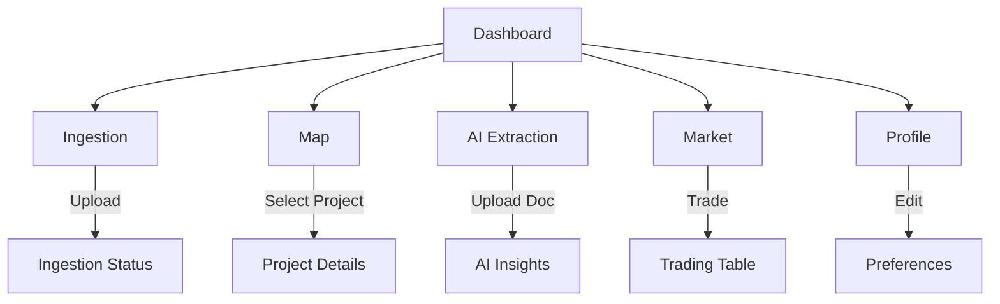

# Universal Carbon Intelligence Platform — Wireframes

## 1. Dashboard (Main Overview)

**Purpose:** High-level summary of carbon data, recent activity, alerts, and quick access to main modules.

---

**Dashboard — Abstract Screen Wireframe**

    

        🌱Logo
        <nav style="display:flex; gap:28px; font-size:1.08em;">
            DashboardIngestMapAIMarketProfile
        </nav>
        ⚙️
    

    

        

            

                

                    
🌍

                    
Total CO₂

                    
1,234,567 t

                

                

                    
📁

                    
Projects

                    
42

                

                

                    
⚠️

                    
Alerts

                    
3

                

                

                    
💹

                    
Market Value

                    
€1.2M

                

            

            

                
Recent Activity

                <ul style="margin:0; padding-left:20px;">
                    <li>Project "Green Forest" updated</li>
                    <li>New dataset ingested</li>
                    <li>Alert: Data anomaly detected</li>
                </ul>
            

            

                
Quick Actions

                <button style="margin-right:12px;">+ Add Data</button>
                <button>Export Report</button>
            

        

        <aside style="flex:1; display:flex; flex-direction:column; gap:20px;">
            

                
👤

                

                  
Jane Doe

                  
Analyst

                

            

            

                
Theme & Accessibility

                
<button style="margin-right:8px;">🌗</button> <button>Aa</button>

            

        </aside>
    

    <footer style="background:linear-gradient(90deg,#2563eb 60%,#38bdf8 100%); color:#fff; padding:14px 32px; text-align:center; font-size:1em; letter-spacing:0.2px; box-shadow:0 -2px 8px 0 rgba(34,60,80,0.08);">
        Theme Toggle | Accessibility | Legal
    </footer>

---

---

## 2. Data Ingestion / Upload

**Purpose:** Upload new datasets, monitor ingestion status, and view ETL logs.

---

**Data Ingestion / Upload — Abstract Screen Wireframe**

    

        🌱Logo
        <nav style="display:flex; gap:28px; font-size:1.08em;">
            DashboardIngestMapAIMarketProfile
        </nav>
        ⚙️
    

    

        

            
⬆️

            
Upload Area

            
Drag & Drop or <button style="background:#2563eb; color:#fff; border:none; border-radius:6px; padding:6px 18px; font-weight:600;">Select File</button>

            
Supported: CSV, GeoJSON, PDF, XLSX

        

        

            
Ingestion Status

            <table style="width:100%; border-collapse:collapse;">
                <tr style="background:#f0f0f0; font-weight:600;"><th>Dataset</th><th>Status</th><th>Progress</th><th>Last Updated</th><th>Actions</th></tr>
                <tr><td>forest.csv</td><td>✅ Complete</td><td>100%</td><td>Today</td><td><button style="background:#059669; color:#fff; border:none; border-radius:5px; padding:4px 12px;">View</button></td></tr>
                <tr><td>rivers.geojson</td><td>⏳ Processing</td><td>60%</td><td>1 min ago</td><td><button style="background:#be123c; color:#fff; border:none; border-radius:5px; padding:4px 12px;">Cancel</button></td></tr>
            </table>
        

        

            
ETL Logs / Error Console

            
[INFO] Ingestion started... [ERROR] File format not supported: .txt

        

    

    <footer style="background:linear-gradient(90deg,#2563eb 60%,#38bdf8 100%); color:#fff; padding:14px 32px; text-align:center; font-size:1em; letter-spacing:0.2px; box-shadow:0 -2px 8px 0 rgba(34,60,80,0.08);">
        Theme Toggle | Accessibility | Help
    </footer>

---

---

## 3. Geospatial Map / Analysis

**Purpose:** Visualize carbon projects, assets, and analytics on an interactive map.

---

**Geospatial Map / Analysis — Abstract Screen Wireframe**

    

        🌱Logo
        <nav style="display:flex; gap:28px; font-size:1.08em;">
            DashboardIngestMapAIMarketProfile
        </nav>
        ⚙️
    

    

        

            

                
🗺️

                
Map View

                
World / Region Map

            

            

                
Layer Controls

                
<input type="checkbox" checked> Projects <input type="checkbox"> Assets <input type="checkbox"> Analytics

                
Legend

                
🟢 Project 🔵 Asset 🟡 Alert

                
Search/Filter

                <input type="text" placeholder="Search..." style="width:100%; padding:6px; border-radius:6px; border:1px solid #e0e7ef;">
            

        

        

            
Project List / Details

            <table style="width:100%; border-collapse:collapse;">
                <tr style="background:#f0f0f0; font-weight:600;"><th>Name</th><th>Type</th><th>Status</th><th>Actions</th></tr>
                <tr><td>Green Forest</td><td>Project</td><td>Active</td><td><button style="background:#059669; color:#fff; border:none; border-radius:5px; padding:4px 12px;">View</button></td></tr>
                <tr><td>Blue River</td><td>Asset</td><td>Inactive</td><td><button style="background:#be123c; color:#fff; border:none; border-radius:5px; padding:4px 12px;">View</button></td></tr>
            </table>
        

    

    <footer style="background:linear-gradient(90deg,#2563eb 60%,#38bdf8 100%); color:#fff; padding:14px 32px; text-align:center; font-size:1em; letter-spacing:0.2px; box-shadow:0 -2px 8px 0 rgba(34,60,80,0.08);">
        Theme Toggle | Accessibility | Map Data Source
    </footer>

---

---

## 4. Document Extraction / AI Insights

**Purpose:** Upload and extract data from documents, view AI-generated insights, and validate results.

---

**Document Extraction / AI Insights — Abstract Screen Wireframe**

    

        🌱Logo
        <nav style="display:flex; gap:28px; font-size:1.08em;">
            DashboardIngestMapAIMarketProfile
        </nav>
        ⚙️
    

    

        

            
📄

            
Document Upload Area

            
<button style="background:#2563eb; color:#fff; border:none; border-radius:6px; padding:6px 18px; font-weight:600;">Upload Document</button>

        

        

            
Extracted Data

            <table style="width:100%; border-collapse:collapse;">
                <tr style="background:#f0f0f0; font-weight:600;"><th>Field</th><th>Value</th><th>Confidence</th><th>Validate</th></tr>
                <tr><td>CO₂</td><td>1234 t</td><td>98%</td><td><input type="checkbox" checked></td></tr>
                <tr><td>Project</td><td>Green Forest</td><td>95%</td><td><input type="checkbox"></td></tr>
            </table>
        

        

            
AI Insights

            <ul style="margin:0; padding-left:20px;">
                <li>Key Finding: High CO₂ reduction</li>
                <li>Warning: Data gap detected</li>
                <li>Suggestion: Upload more recent data</li>
            </ul>
        

    

    <footer style="background:linear-gradient(90deg,#2563eb 60%,#38bdf8 100%); color:#fff; padding:14px 32px; text-align:center; font-size:1em; letter-spacing:0.2px; box-shadow:0 -2px 8px 0 rgba(34,60,80,0.08);">
        Theme Toggle | Accessibility | Feedback
    </footer>

---

---

## 5. Market / Trading View

**Purpose:** Explore carbon market data, trade credits, and view price trends.

---

**Market / Trading View — Abstract Screen Wireframe**

    

        🌱Logo
        <nav style="display:flex; gap:28px; font-size:1.08em;">
            DashboardIngestMapAIMarketProfile
        </nav>
        ⚙️
    

    

        

            

                
💰

                
Market Overview

                
Price: €25.00 | Volume: 10k | Trend: 📈

            

            

                
📊

                
Price Chart

                
Analytics & Trends

            

        

        

            
Trading Table

            <table style="width:100%; border-collapse:collapse;">
                <tr style="background:#f0f0f0; font-weight:600;"><th>Asset</th><th>Price</th><th>Change</th><th>Buy/Sell</th></tr>
                <tr><td>CO₂ Credit</td><td>€25.00</td><td style="color:#059669; font-weight:600;">+2%</td><td><button style="background:#059669; color:#fff; border:none; border-radius:5px; padding:4px 12px;">Buy</button> <button style="background:#be123c; color:#fff; border:none; border-radius:5px; padding:4px 12px;">Sell</button></td></tr>
                <tr><td>Forest Bond</td><td>€10.00</td><td style="color:#be123c; font-weight:600;">-1%</td><td><button style="background:#059669; color:#fff; border:none; border-radius:5px; padding:4px 12px;">Buy</button> <button style="background:#be123c; color:#fff; border:none; border-radius:5px; padding:4px 12px;">Sell</button></td></tr>
            </table>
        

    

    <footer style="background:linear-gradient(90deg,#2563eb 60%,#38bdf8 100%); color:#fff; padding:14px 32px; text-align:center; font-size:1em; letter-spacing:0.2px; box-shadow:0 -2px 8px 0 rgba(34,60,80,0.08);">
        Theme Toggle | Accessibility | Market Info
    </footer>

---

---

## 6. User Profile / Settings

**Purpose:** Manage user info, preferences, API keys, and accessibility options.

---

**User Profile / Settings — Abstract Screen Wireframe**

    

        🌱Logo
        <nav style="display:flex; gap:28px; font-size:1.08em;">
            DashboardIngestMapAIMarketProfile
        </nav>
        ⚙️
    

    

        

            
👤

            
User Info

            
Name: Jane Doe Email: jane@carbon.com Role: Analyst Org: GreenOrg

        

        

            

                
Preferences

                
Theme: <button style="background:#2563eb; color:#fff; border:none; border-radius:6px; padding:4px 12px;">🌗</button> | Language: <select style="border-radius:6px; border:1px solid #e0e7ef; padding:2px 8px;"><option>EN</option><option>NL</option></select>

                
Accessibility: <button style="background:#38bdf8; color:#fff; border:none; border-radius:6px; padding:4px 12px;">Aa</button>

            

            

                
API Keys / Integrations

                
API Key: <input type="text" value="••••••••" readonly style="border-radius:6px; border:1px solid #e0e7ef; padding:2px 8px; background:#f3f4f6; color:#222; font-family:JetBrains Mono,monospace; font-size:1em; width:90px; text-align:center;" >

                
<button style="background:#2563eb; color:#fff; border:none; border-radius:6px; padding:4px 12px;">Regenerate</button>

            

        

        

            <button style="background:#be123c; color:#fff; border:none; border-radius:6px; padding:8px 24px; font-weight:600;">Logout</button>
        

    

    <footer style="background:linear-gradient(90deg,#2563eb 60%,#38bdf8 100%); color:#fff; padding:14px 32px; text-align:center; font-size:1em; letter-spacing:0.2px; box-shadow:0 -2px 8px 0 rgba(34,60,80,0.08);">
        Theme Toggle | Accessibility | Support
    </footer>

---

---

## 7. Theme Toggle & Accessibility

- Theme toggle always in header and footer
- High-contrast mode, font size controls, keyboard navigation
- All forms and tables: clear labels, focus indicators, ARIA attributes

---

## 8. Navigation & Layout (Mermaid Diagram)

---

**Note:**
- All screens are responsive (mobile/tablet/desktop)
- Theme toggle and accessibility controls are always visible
- Use semantic HTML and ARIA for accessibility
- Wireframes are ready for UI design and frontend implementation
